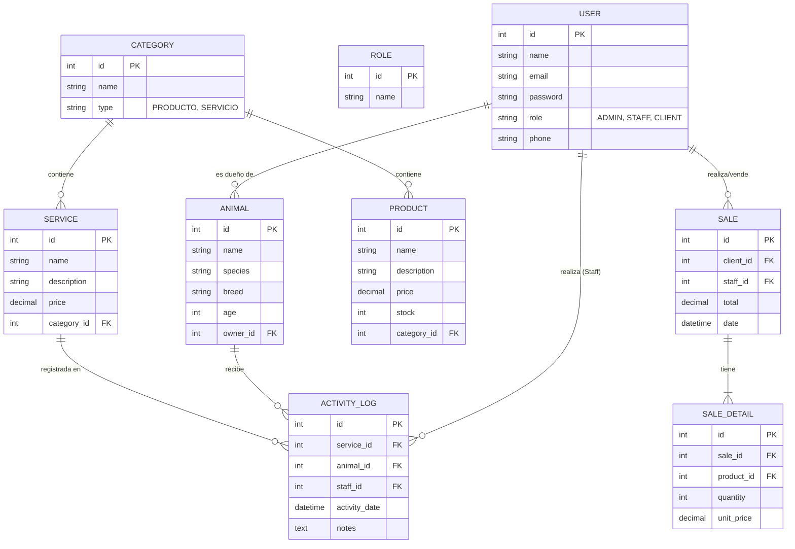

# Modelo Entidad-Relación - Pulguitas Veterinaria

Este modelo define la estructura de datos necesaria para gestionar inventarios, actividades de salud, usuarios con roles específicos y ventas.

## Diagrama ER (Mermaid)

## Descripción de Entidades

### 1. Usuarios (Users)
- **Roles**:
    - `ADMIN`: Control total sobre categorías, productos, servicios y gestión de otros usuarios.
    - `STAFF`: Personal de la veterinaria que registra ventas y realiza actividades de salud/recreación.
    - `CLIENT`: Dueños de mascotas que realizan compras.
- **Atributos**: Correo electrónico único para login, contraseña encriptada y datos de contacto.

### 2. Categorías (Categories)
- Organizan tanto los **elementos de venta** (Alimentos, Varios) como los **servicios** (Salud, Recreación).

### 3. Elementos de Venta (Products)
- Registro de stock y precios. Pertenecen a categorías de tipo "PRODUCTO".

### 4. Actividades y Servicios (Services)
- Definición de servicios ofrecidos (ej. "Vacunación", "Paseo recreativo"). Pertenecen a categorías de tipo "SERVICIO".

### 5. Animales (Animals)
- Vinculados a un usuario de tipo `CLIENT`. Esencial para el seguimiento de actividades de salud e higiene.

### 6. Transacciones y Registros
- **Sale / SaleDetail**: Registro detallado de compras de productos.
- **ActivityLog**: Registro de qué servicio se le prestó a qué animal, quién lo realizó y en qué fecha.
