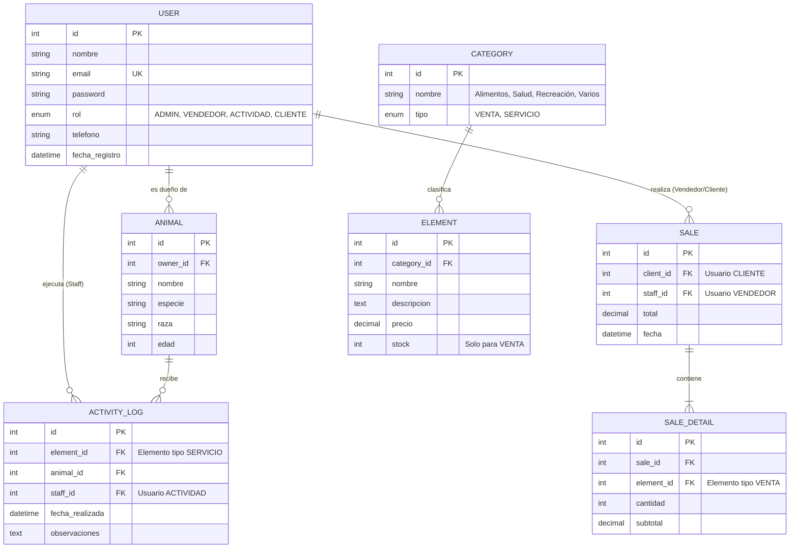

# Modelo Entidad-Relación Detallado - Pulguitas

Este documento describe la estructura lógica de la base de datos para la aplicación **Pulguitas**. El diseño se centra en la diferenciación de roles de usuario, la gestión de inventarios (productos y servicios) y el seguimiento de actividades de salud y recreación de las mascotas.

## Diagrama de Entidad-Relación (Mermaid)

## Especificación de las Entidades

### 1. Usuarios e Identidad
*   **ADMIN**: Perfil con privilegios para crear/editar categorías, elementos (precios/stock) y gestionar otros usuarios.
*   **VENDEDOR (Staff)**: Encargado de procesar las compras de los clientes (`SALE`).
*   **ACTIVIDAD (Staff)**: Especialistas encargados de registrar las actividades de salud y recreación (`ACTIVITY_LOG`).
*   **CLIENTE**: Dueños de mascotas que registran sus datos para realizar compras y seguimiento de sus animales.

### 2. Categorización (Pulmón del Sistema)
El Administrador gestiona estas 4 categorías base, cada una vinculada a un tipo (`Venta` o `Servicio`):
1.  **Venta de Alimentos**: Tipo Venta (Maneja Stock).
2.  **Actividades y Recreación**: Tipo Servicio (Sin Stock, genera Log).
3.  **Salud e Higiene**: Tipo Servicio (Sin Stock, genera Log).
4.  **Elementos Varios**: Tipo Venta (Maneja Stock).

### 3. Registro de Elementos (Inventory)
*   Contiene tanto los productos físicos (alimentos, collares) como los servicios prestados (consultas, baños, paseos).
*   Los elementos de tipo `VENTA` se descuentan del stock al realizar una compra.

### 4. Registro de Actividades de Salud y Recreación
*   Cada vez que un animal recibe una "Actividad", se genera un registro en `ACTIVITY_LOG`.
*   Incluye: ¿Qué se hizo?, ¿A qué mascota?, ¿Quién lo hizo? y observaciones adicionales.

### 5. Registro de Ventas
*   Documenta la compra formal de productos por parte de los clientes.
*   Vincula al vendedor (Staff) y al cliente (Dueño).
