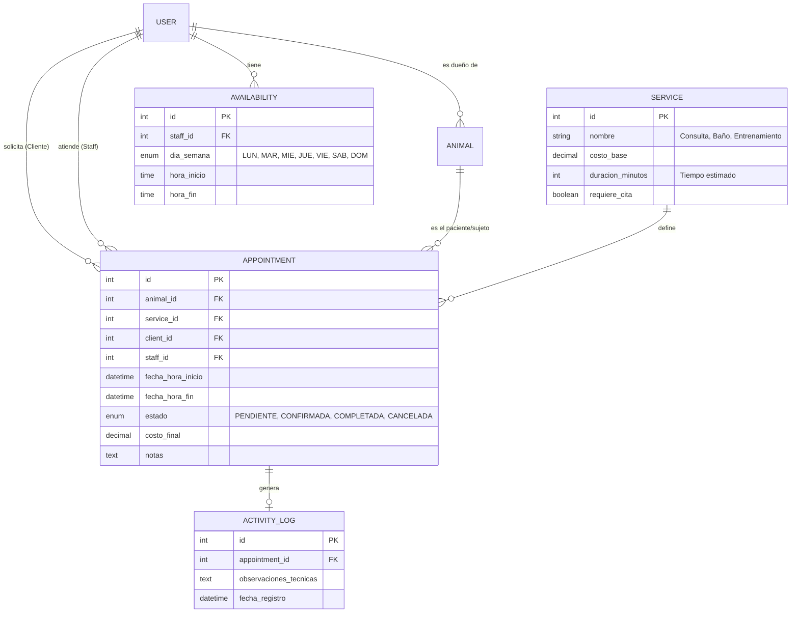

# Modelo Entidad-Relación Evolucionado - Pulguitas (Gestión de Tiempos y Citas)

He actualizado el modelo para incluir la gestión de **Citas (Appointments)**, control de **Horarios** y **Costos** detallados, permitiendo a los clientes programar actividades de salud y recreación.

## Diagrama de Entidad-Relación Actualizado (Mermaid)

## Nuevas Capacidades del Modelo

### 1. Gestión de Tiempos (Horarios y Disponibilidad)
*   **Entidad `AVAILABILITY`**: Permite al Administrador definir en qué horarios trabaja el personal de salud y recreación. Esto evita solapamientos de citas.
*   **Duración Estimada**: Cada servicio (ej. "Corte de pelo") tiene un campo `duracion_minutos` para bloquear el calendario automáticamente.

### 2. Control de Citas (Appointments)
*   **Estados de Cita**: Seguimiento desde que se solicita (Pendiente) hasta que se realiza (Completada).
*   **Costo Final**: Permite ajustar el precio base del servicio si hubo complicaciones o cargos extra durante la actividad.

### 3. Registro de Actividades Vinculado
*   A diferencia de una simple venta, la cita genera un `ACTIVITY_LOG` (Historial Clínico/Recreativo) que queda guardado perpetuamente para la mascota.

### 4. Flujo para el Dueño (Cliente)
*   El cliente puede ver los horarios disponibles.
*   Selecciona su mascota y el servicio.
*   El sistema reserva el bloque de tiempo del Staff responsable.
