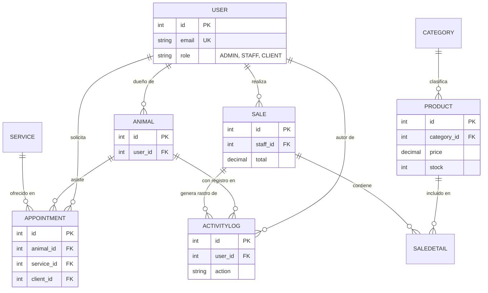

# Documentación Integral del Sistema - Veterinaria Pulguitas

Este documento contiene la especificación completa del sistema, incluyendo requerimientos, modelos de datos y scripts de implementación para Google Cloud SQL.

---

## 1. Requerimientos del Sistema

### 1.1 Requerimientos Funcionales (RF)
- **RF-01 Gestión de Usuarios**: El sistema debe permitir el registro, login y gestión de roles (ADMIN, STAFF, CLIENT).
- **RF-02 Registro de Mascotas**: Los clientes deben poder registrar sus mascotas vinculadas a su cuenta.
- **RF-03 Agenda de Citas**: El sistema permitirá agendar, cancelar y completar citas médicas o estéticas.
- **RF-04 Historial Médico (Logs)**: Cada acción realizada sobre una mascota (citas, vacunas) debe registrarse automáticamente en un historial.
- **RF-05 Gestión de Inventario**: El sistema debe permitir el control de stock de productos por categorías.
- **RF-06 Punto de Venta (POS)**: El sistema debe procesar ventas, generar detalles de factura y descontar stock automáticamente.
- **RF-07 Auditoría de Acciones**: Registro de qué usuario realizó cada cambio importante en el sistema.

### 1.2 Requerimientos No Funcionales (RNF)
- **RNF-01 Seguridad**: Todas las contraseñas deben estar encriptadas (BCrypt) y las rutas protegidas por JWT.
- **RNF-02 Disponibilidad**: La base de datos debe residir en la nube (Google Cloud SQL) para acceso 24/7.
- **RNF-03 Integridad**: Uso de transacciones SQL para asegurar que las ventas no dejen datos inconsistentes.
- **RNF-04 Escalabilidad**: Arquitectura modular en Node.js para permitir el crecimiento del sistema.

---

## 2. Reglas de Negocio y Relaciones
- Un **Usuario** puede tener muchas **Mascotas** (1:N).
- Una **Cita** vincula obligatoriamente a un **Animal**, un **Usuario (Cliente)** y un **Servicio** (N:1).
- Un **Producto** pertenece a una única **Categoría** (N:1).
- Una **Venta** genera múltiples **Detalles de Venta** (1:N), vinculando productos específicos.
- Los **ActivityLogs** son registros inmutables vinculados a Usuarios, Animales o Ventas.

---

## 3. Diagrama Entidad-Relación (ERD)



---

## 4. Implementación SQL (DDL)

```sql
-- Creación de Tablas Principales

CREATE TABLE Users (
    id INT AUTO_INCREMENT PRIMARY KEY,
    name VARCHAR(255) NOT NULL,
    email VARCHAR(255) UNIQUE NOT NULL,
    password VARCHAR(255) NOT NULL,
    role ENUM('ADMIN', 'STAFF', 'CLIENT') DEFAULT 'CLIENT',
    createdAt DATETIME,
    updatedAt DATETIME
);

CREATE TABLE Categories (
    id INT AUTO_INCREMENT PRIMARY KEY,
    name VARCHAR(255) NOT NULL,
    createdAt DATETIME,
    updatedAt DATETIME
);

CREATE TABLE Products (
    id INT AUTO_INCREMENT PRIMARY KEY,
    name VARCHAR(255) NOT NULL,
    price DECIMAL(10,2) NOT NULL,
    stock INT DEFAULT 0,
    category_id INT,
    FOREIGN KEY (category_id) REFERENCES Categories(id),
    createdAt DATETIME,
    updatedAt DATETIME
);

CREATE TABLE Animals (
    id INT AUTO_INCREMENT PRIMARY KEY,
    name VARCHAR(255) NOT NULL,
    owner_id INT,
    FOREIGN KEY (owner_id) REFERENCES Users(id),
    createdAt DATETIME,
    updatedAt DATETIME
);

CREATE TABLE Sales (
    id INT AUTO_INCREMENT PRIMARY KEY,
    total DECIMAL(10,2) DEFAULT 0,
    staff_id INT,
    FOREIGN KEY (staff_id) REFERENCES Users(id),
    createdAt DATETIME,
    updatedAt DATETIME
);

CREATE TABLE ActivityLogs (
    id INT AUTO_INCREMENT PRIMARY KEY,
    action VARCHAR(255) NOT NULL,
    description TEXT,
    entity_type ENUM('SISTEMA', 'MASCOTA', 'VENTA', 'CITA'),
    user_id INT,
    animal_id INT,
    sale_id INT,
    FOREIGN KEY (user_id) REFERENCES Users(id),
    FOREIGN KEY (animal_id) REFERENCES Animals(id),
    FOREIGN KEY (sale_id) REFERENCES Sales(id),
    createdAt DATETIME,
    updatedAt DATETIME
);
```
