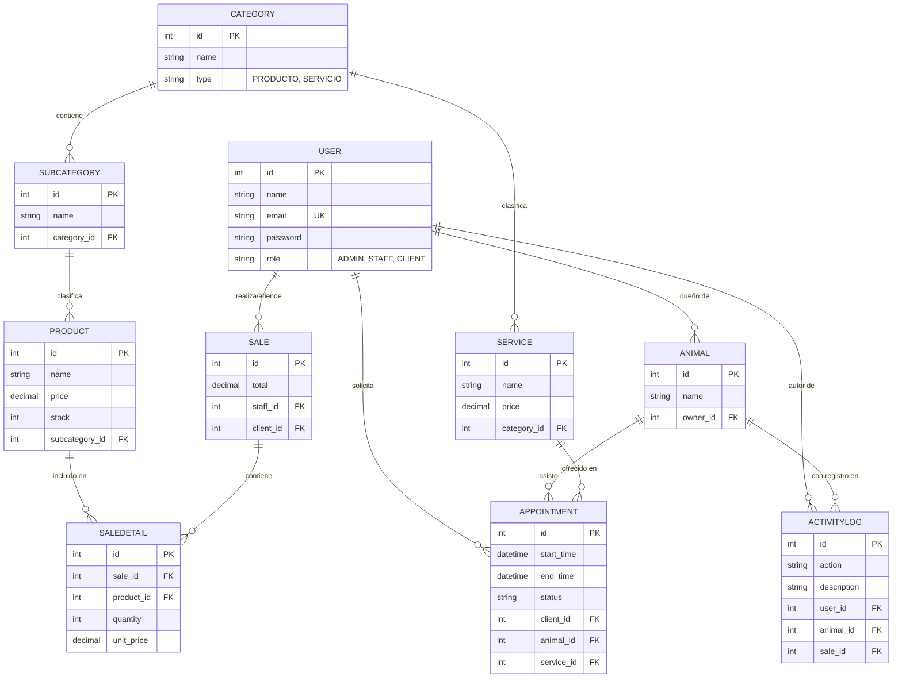

# Documentación Integral del Sistema - Veterinaria Pulguitas

Este documento contiene la especificación completa del sistema, incluyendo requerimientos, modelos de datos y scripts de implementación para Google Cloud SQL.

---

## 1. Requerimientos del Sistema

### 1.1 Requerimientos Funcionales (RF)
- **RF-01 Gestión de Usuarios**: El sistema debe permitir el registro, login y gestión de roles (ADMIN, STAFF, CLIENT).
- **RF-02 Registro de Mascotas**: Los clientes deben poder registrar sus mascotas vinculadas a su cuenta.
- **RF-03 Agenda de Citas**: El sistema permitirá agendar, cancelar y completar citas médicas o estéticas.
- **RF-04 Historial Médico (Logs)**: Cada acción realizada sobre una mascota (citas, vacunas) debe registrarse automáticamente en un historial.
- **RF-05 Gestión de Inventario**: El sistema debe permitir el control de stock de productos por categorías.
- **RF-06 Punto de Venta (POS)**: El sistema debe procesar ventas, generar detalles de factura y descontar stock automáticamente.
- **RF-07 Auditoría de Acciones**: Registro de qué usuario realizó cada cambio importante en el sistema.

### 1.2 Requerimientos No Funcionales (RNF)
- **RNF-01 Seguridad**: Todas las contraseñas deben estar encriptadas (BCrypt) y las rutas protegidas por JWT.
- **RNF-02 Disponibilidad**: La base de datos debe residir en la nube (Google Cloud SQL) para acceso 24/7.
- **RNF-03 Integridad**: Uso de transacciones SQL para asegurar que las ventas no dejen datos inconsistentes.
- **RNF-04 Escalabilidad**: Arquitectura modular en Node.js para permitir el crecimiento del sistema.

---

## 2. Reglas de Negocio y Relaciones
- Un **Usuario** puede tener muchas **Mascotas** (1:N).
- Una **Cita** vincula obligatoriamente a un **Animal**, un **Usuario (Cliente)** y un **Servicio** (N:1).
- Una **Subcategoría** pertenece a una única **Categoría** (N:1).
- Un **Producto** pertenece a una única **Subcategoría** (N:1).
- Una **Venta** genera múltiples **Detalles de Venta** (1:N), vinculando productos específicos.
- Los **ActivityLogs** son registros inmutables vinculados a Usuarios, Animales o Ventas.

---

## 3. Diagrama Entidad-Relación (ERD)



---

## 4. Implementación SQL (DDL)

```sql
-- Creación de Tablas Principales

CREATE TABLE Users (
    id INT AUTO_INCREMENT PRIMARY KEY,
    name VARCHAR(255) NOT NULL,
    email VARCHAR(255) UNIQUE NOT NULL,
    password VARCHAR(255) NOT NULL,
    role ENUM('ADMIN', 'STAFF', 'CLIENT') DEFAULT 'CLIENT',
    createdAt DATETIME,
    updatedAt DATETIME
);

CREATE TABLE Categories (
    id INT AUTO_INCREMENT PRIMARY KEY,
    name VARCHAR(255) NOT NULL,
    type ENUM('PRODUCTO', 'SERVICIO') NOT NULL DEFAULT 'PRODUCTO',
    image_url VARCHAR(255),
    createdAt DATETIME,
    updatedAt DATETIME
);

CREATE TABLE Subcategories (
    id INT AUTO_INCREMENT PRIMARY KEY,
    name VARCHAR(255) NOT NULL,
    category_id INT,
    FOREIGN KEY (category_id) REFERENCES Categories(id),
    createdAt DATETIME,
    updatedAt DATETIME
);

CREATE TABLE Products (
    id INT AUTO_INCREMENT PRIMARY KEY,
    name VARCHAR(255) NOT NULL,
    description TEXT,
    price DECIMAL(10,2) NOT NULL,
    stock INT DEFAULT 0,
    subcategory_id INT,
    target_animal VARCHAR(255) DEFAULT 'Todos',
    life_stage VARCHAR(255) DEFAULT 'Todas las edades',
    brand VARCHAR(255),
    features TEXT,
    FOREIGN KEY (subcategory_id) REFERENCES Subcategories(id),
    createdAt DATETIME,
    updatedAt DATETIME
);

CREATE TABLE Animals (
    id INT AUTO_INCREMENT PRIMARY KEY,
    name VARCHAR(255) NOT NULL,
    owner_id INT,
    FOREIGN KEY (owner_id) REFERENCES Users(id),
    createdAt DATETIME,
    updatedAt DATETIME
);

CREATE TABLE Sales (
    id INT AUTO_INCREMENT PRIMARY KEY,
    total DECIMAL(10,2) DEFAULT 0,
    staff_id INT,
    FOREIGN KEY (staff_id) REFERENCES Users(id),
    createdAt DATETIME,
    updatedAt DATETIME
);

CREATE TABLE ActivityLogs (
    id INT AUTO_INCREMENT PRIMARY KEY,
    action VARCHAR(255) NOT NULL,
    description TEXT,
    entity_type ENUM('SISTEMA', 'MASCOTA', 'VENTA', 'CITA'),
    user_id INT,
    animal_id INT,
    sale_id INT,
    FOREIGN KEY (user_id) REFERENCES Users(id),
    FOREIGN KEY (animal_id) REFERENCES Animals(id),
    FOREIGN KEY (sale_id) REFERENCES Sales(id),
    createdAt DATETIME,
    updatedAt DATETIME
);
```

---

## 5. Modelo Relacional

El modelo relacional detalla la estructura lógica de la base de datos, enfocándose en la integridad referencial.

| Tabla | Atributos Principales | Relaciones |
|-------|-----------------------|------------|
| **Users** | `id`, `name`, `email`, `password`, `role` (ADMIN, STAFF, CLIENT) | - |
| **Categories** | `id`, `name`, `type`, `image_url` | 1:N con Subcategories |
| **Subcategories** | `id`, `name`, `category_id` | N:1 con Categories, 1:N con Products |
| **Products** | `id`, `name`, `price`, `stock`, `subcategory_id` | N:1 con Subcategories, 1:N con SaleDetails |
| **Animals** | `id`, `name`, `owner_id` | N:1 con Users (Dueño) |
| **Services** | `id`, `name`, `price`, `category_id` | N:1 con Categories |
| **Appointments** | `id`, `start_time`, `end_time`, `status`, `client_id`, `animal_id`, `service_id` | N:1 con Users, Animals, Services |
| **Sales** | `id`, `total`, `staff_id`, `client_id` | N:1 con Users (Staff y Cliente) |
| **SaleDetails** | `id`, `sale_id`, `product_id`, `quantity`, `unit_price` | N:1 con Sales, Products |
| **ActivityLogs** | `id`, `action`, `description`, `user_id`, `animal_id`, `sale_id` | N:1 con Users, Animals, Sales |

---

## 6. Manual de Funciones

### 6.1 Funciones del Administrador (ADMIN)
El administrador tiene control total sobre la configuración maestra del sistema:
- **Gestión de Jerarquía**: Crear, editar y eliminar Categorías y Subcategorías para organizar productos y servicios.
- **Control de Inventario**: Solo el administrador puede crear nuevos productos, modificar sus precios, descripciones y ajustar el stock manualmente.
- **Gestión de Personal**: Supervisar las acciones del staff a través de los Logs de Actividad.
- **Configuración de Servicios**: Definir los servicios disponibles (consultas, peluquería, etc.) y sus costos base.

### 6.2 Funciones del Personal (STAFF)
El personal operativo se enfoca en la atención al cliente:
- **Punto de Venta (POS)**: Registrar ventas de productos a clientes, lo cual descuenta automáticamente el stock del inventario.
- **Gestión de Citas**: Agendar citas para mascotas, verificar disponibilidad y marcar citas como completadas o canceladas.
- **Registro de Mascotas**: Ayudar a los dueños a registrar sus mascotas si es necesario.

### 6.3 Funciones del Cliente (CLIENT)
El cliente interactúa con el sistema para servicios específicos:
- **Auto-Registro**: Crear su propia cuenta en el sistema para acceder a servicios personalizados.
- **Perfil de Mascotas**: Registrar y mantener actualizada la información de sus mascotas (nombre, especie, etc.).
- **Programación de Actividades**: Solicitar o programar actividades (citas médicas, peluquería, guardería) para sus mascotas.
- **Historial de Compras**: (En desarrollo) Visualizar sus compras realizadas en la tienda.

---

## 7. Flujo de Trabajo: Gestión de Productos
1. El **Admin** crea una **Categoría** (Ej: "Alimentos").
2. El **Admin** crea una **Subcategoría** ligada a la categoría (Ej: "Alimento Seco Perro").
3. El **Admin** registra el **Producto** vinculándolo a la subcategoría y asignando un **Stock** inicial.
4. El sistema restringe cualquier modificación de estos datos a usuarios sin el rol `ADMIN`.
5. Durante una venta realizada por el **Staff**, el **Stock** disminuye proporcionalmente a la cantidad vendida.
